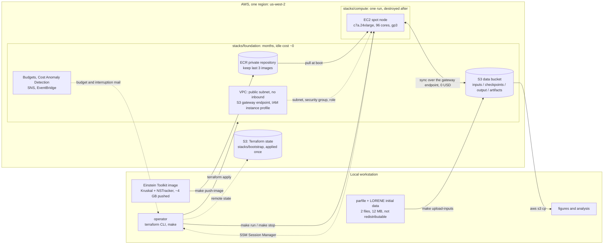
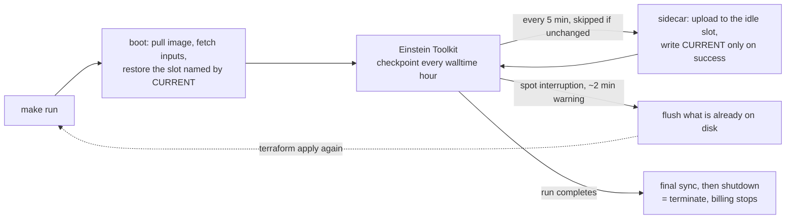

# BNS Einstein Toolkit — AWS infrastructure

Terraform for running the Einstein Toolkit gallery's [binary neutron star
example](https://einsteintoolkit.org/gallery/bns/index.html) on one AWS spot
node: the node, an S3 bucket that acts as the system of record, a private
registry for the container image, and the cost guardrails that keep the
project inside a 200 USD cap.

This repository is the sibling of
[gw230529-einstein-toolkit-aws-tf](https://github.com/s-sasaki-earthsea-wizard/gw230529-einstein-toolkit-aws-tf),
which ran a BH-NS merger to completion on the same design in August 2026 —
14 spot nodes, 12 interruptions, about 138 USD. The infrastructure is
imported from there commit by commit: the first commit is a verbatim copy,
and `git log` is the list of what had to differ for a BNS. Design reasoning
lives in [docs/](docs/); the GW230529 project's **measured numbers** live in
its [wiki](https://github.com/s-sasaki-earthsea-wizard/gw230529-einstein-toolkit-aws-tf/wiki).

## Status

Nothing has been applied or run yet. What is real and what is not:

| | State |
| --- | --- |
| Terraform stacks, sidecar, spot handling, relaunch loop, monitors | Inherited and validated (`make check`); not yet applied under the `bns` prefix |
| Gallery inputs: parfile, LORENE data set, thornlist | Fetched and checksum-pinned; the derived cloud parfile passes Cactus's parameter check |
| Container image | **Missing NSTracker.** The GW230529 image compiles every other thorn this parfile activates |
| Throughput, memory, checkpoint size, import time on AWS | **Not measured.** Every AWS number below is an estimate until the first probe |
| Validation against the gallery's own run log | Working (`make validate-run`); not yet exercised against a live run |
| Post-processing | Inherited BH-NS scripts, not yet adapted |

The open issues are the work list; each says what is missing and why.

## The simulation

The gallery example evolves an equal-mass, irrotational binary from LORENE
initial data through merger into a hypermassive neutron star.

| | Gallery BNS |
| --- | --- |
| Initial data | LORENE `G2_I12vs12_D4R33T21_45km`: Γ = 2 polytrope, 1.4456 M☉ baryon mass each, 45 km separation |
| Physics | GRHydro + ML_BSSN, EOS_Omni polytrope, no magnetic field |
| Symmetry | 180° rotation about z + reflection in z — a quarter domain |
| Grid | 400 M☉ cube, dx₀ = 8, 7 levels per star (finest 0.125), boxes tracked by NSTracker; the Trigger thorn moves the refinement to the origin after merger |
| Time | dt = 0.0125 per iteration, 200,000 iterations to t = 2500 M☉ (≈ 12.3 ms) |
| Merger | t ≈ 1750 (central density steps at 1751; Ψ₄ at r = 300 peaks at 2059) |
| Output | 2D density every 19.2 M☉ (130 frames), Ψ₄ at 8 radii, scalars every 256 iterations |

The grid is small — about 8.3 M points, against 10.1 M for GW230529 — but
the time step is finer and the run longer, so the total work is about 1.3×
GW230529's while the per-point physics (pure hydro, BSSN) is lighter. What
the gallery's own runs of this parfile say:

| Machine | Configuration | Wall clock | Memory |
| --- | --- | --- | --- |
| Teton (INL), 2026-06-04 | 2 nodes, 768 cores as 32 ranks × 24 threads | 10 h 33 min | 43.8 GByte (Carpet), ~89 GiB resident |
| Frontera, gallery page | `--procs=128 --num-threads=4` | ~30 h | ~64 GB |

Scaled to one node those bracket roughly **20–60 hours on c7a.24xlarge, 40–115
USD**; a per-point comparison with the GW230529 measurements puts a ceiling
near 135 USD. The 90 minute probe (`make upload-probe`, 3–4 USD) is what
turns the band into a number, and it is the first thing to run.

## Architecture



Four properties the picture is meant to make obvious:

- **S3 is the system of record; EBS is scratch.** The node holds nothing that
  matters for longer than one sync interval, so losing it to a spot
  interruption costs minutes, not a run.
- **The stacks are split by lifetime, not by environment.** `foundation` bills
  ~1 USD/month and stays; `compute` is created for a run and destroyed after.
  A `destroy` in `compute` cannot reach the data or the image — they are not
  in that state file.
- **Nothing listens.** The security group has no ingress rules; operator
  access is SSM Session Manager, which the node opens outbound. (The gallery
  parfile's built-in HTTPD is dropped for the same reason.)
- **The two artefacts the image does not carry** — the parfile and the LORENE
  initial data — arrive from the private bucket at boot. They are Einstein
  Toolkit gallery files, so they are neither committed here nor baked into
  ECR.

### During a run



Checkpoints alternate between `checkpoints/slot-a/` and `checkpoints/slot-b/`,
which holds S3 at two generations per slot instead of the one-generation-per-
hour growth a push-only mirror would show. A push mirrors the whole checkpoint
directory into a slot, so the sidecar also prunes the volume to two
generations after each successful push — without that the volume fills after
a few resumes and ends the run, which Cactus will not prevent on its own.
`CURRENT` is written only after an upload returns success, so a node reclaimed
mid-upload leaves a torn set that restore will not select — a timestamp would
have picked exactly that set, because it is the newest.

The GW230529 project also found, and fixed, an effect specific to recovery:
restoring 160 GB of checkpoints through the page cache filled one NUMA node
and put a third of the working set on the wrong socket, tripling the
iteration time. The node drops the page cache between restore and `docker
run`; that fix is inherited and matters here too, at a smaller scale.

[docs/architecture.md](docs/architecture.md) carries the detailed diagrams and
the reasoning behind each choice, together with the GW230529 measurements the
design was tuned on.

## Layout

```text
stacks/
  bootstrap/    S3 bucket holding the state of the other stacks. Applied once.
  foundation/   VPC, data bucket, ECR, IAM, budgets. Lives for months, idle cost ~0.
  compute/      Spot instance and launch template. Created per run, destroyed after.
modules/
  network/      VPC, public subnets, internet gateway, S3 gateway endpoint, security group
  storage/      Data bucket and its per-prefix lifecycle rules
  registry/     ECR repository and image retention
  iam/          Instance role: SSM, one ECR repository, one S3 bucket
  cost_guard/   Budgets, Cost Anomaly Detection, SNS (us-east-1)
  spot_node/    Launch template, spot instance, interruption alerting
templates/
  user_data.sh.tftpl   Node bootstrap: pull image, fetch inputs, restore state, sync, self-terminate
postprocessing/
  Dockerfile           Pinned render environment: kuibit, matplotlib, ffmpeg
  plot_psi4.py         Psi4 (2,2) waveform            -- BH-NS version, to be adapted
  plot_timeseries.py   Density, horizon masses, mass   -- BH-NS version, to be adapted
  render_frames.py     Density frames, movie, 3-panel  -- should work on rho.xy.h5 as is
scripts/
  fetch_inputs.sh      Download the gallery artefacts, checksum pinned (--reference: the gallery's run log)
  upload_inputs.sh     Derive the cloud parfile, check it, upload it with the LORENE data
  fetch_results.sh     Sync a finished run's output/ prefix into results/
  pack_results.sh      Compress a results tree to tar.gz, verify, delete the tree
  read_throughput.sh   sec/iter, cost projection, LORENE import time out of a run log
  validate_against_reference.sh  Compare a run's info lines with the gallery's, iteration by iteration
  run_ledger.sh        Every node that served a run: uptime, downtime, effective compute
  relaunch_until_done.sh  Keep relaunching the spot node until the run finishes
  region_scout.sh      Compare regions on spot score, price and vCPU quota
  check_permissions.sh Simulate every IAM action the stacks need, creating nothing
  check_secrets.sh     Fail if a tracked file carries an account id or ARN
  check_alerts.sh      Fail unless both SNS topics still have a confirmed subscriber
policies/
  terraform-operator.json        The single IAM policy the Terraform principal needs
  terraform-bootstrap-user.json  What the IAM user itself keeps: assume the two
                                 project roles, and rotate its own access key
```

The stacks are split by lifetime, not by environment. `terraform destroy` in
`stacks/compute` tears down the instance without the simulation bucket or the
container image ever entering the plan.

## Requirements

- Terraform >= 1.11 — the S3 backend locks through a lock file object, so no
  DynamoDB table is needed
- AWS CLI v2 with a configured profile. **Not the account root user** — root
  cannot be bounded by IAM, so a mistaken `destroy` or a runaway `for_each`
  has no ceiling. Use an IAM user or role and verify it with
  `make check-permissions`.
- An IAM principal carrying [policies/terraform-operator.json](policies/terraform-operator.json) —
  a single policy scoped to `bns-*` resources, with an explicit Deny that
  keeps destructive EC2 actions off anything not tagged `Project=bns`.
  See [policies/README.md](policies/README.md) for what can and cannot be
  scoped, and why. If this account also runs the GW230529 project, the two
  operator roles are distinct and the bootstrap user policy has to name both
  (see the issue tracker for the open decision on the IAM user itself)
- For watching a run rather than changing one, nothing beyond the same key:
  `stacks/foundation` creates a read-only `bns-observer` role that is
  assumed without MFA. See [Watching a run without MFA](#watching-a-run-without-mfa)
- Spot vCPU quota (`L-34B43A08`) of at least 96 in the chosen region.
  `make region-scout` reports the current value; an account that ran
  GW230529 already holds 256 in us-west-2
- A container image with NSTracker compiled in. The GW230529 image
  (`gw230529-einstein-toolkit`, ET_2025_05 + FUKA) carries GRHydro, LORENE,
  Meudon_Bin_NS, ML_BSSN, the symmetry thorns and Trigger, but not NSTracker,
  which the gallery's `bns.th` pulls from `bitbucket.org/knarrff/nstracker`.
  Rebuilding with that one line added is the open item that gates everything
  after `make push-image`

## First run

```bash
make setup             # create .env, backend.hcl and terraform.tfvars from templates
                       # then edit every CHANGEME value

eval "$(make login)"   # assume the operator role with MFA
                       # Terraform cannot prompt for an MFA token itself, so the
                       # session goes in the environment. fmt, validate,
                       # check-secrets and check need no session at all.

make check-permissions # confirm the operator can do everything, creating nothing
make region-scout      # compare candidate regions and the three c7a sizes

make init-bootstrap && make apply-bootstrap
make init-foundation && make apply-foundation
                       # then click "Confirm subscription" in both mails
make check-alerts      # and verify the alerts can actually be delivered

make push-image        # push the locally built image (LOCAL_IMAGE=bns-et:local) to ECR
make fetch-inputs      # download the gallery parfile, LORENE data set and thornlist
make upload-inputs     # derive the cloud parfile from it, check it, upload both

make init-compute
eval "$(make login)"   # assume the operator role with MFA -- needed by every
                       # target below, and by every terraform command
make run               # launch the spot node
make ssm               # open a shell on it
make throughput        # read sec/iter and the cost projection out of the run log
make stop              # terminate it
```

Run the probe before the run: `make upload-probe PROBE_MINUTES=90` uploads a
second parfile alongside the production one, identical except that it
terminates on wall clock instead of on a physical time it will never reach —
which is the only thing bounding what a probe bills, since `auto_shutdown`
fires when the run exits. Point `parfile` at `bns_probe.par` in
`stacks/compute/terraform.tfvars` and the node ends itself on schedule.

`fetch-inputs` and `upload-inputs` are not optional for a simulation run. The
parfile and the LORENE data are Einstein Toolkit gallery artefacts, so they
are neither committed here nor baked into the container image; this
repository keeps only their URLs and checksums, `fetch-inputs` downloads them
into a gitignored `upstream/`, and the node reads them from the private bucket
at boot.

`upload-inputs` does not upload the gallery parfile as it stands. That file is
written for a batch queue under simfactory: it checkpoints only when the job's
wall clock runs out, keeps its checkpoints beside its output, carries a
simfactory placeholder Cactus cannot parse, and runs a web server nothing
here can reach. The cloud variant is derived from it — hourly checkpoints,
`checkpoint_keep = 2`, checkpoints under `../CHECKPOINTS` where the sidecar's
mount split expects them, a numeric `TerminationTrigger::max_walltime`, HTTPD
dropped — and checked for everything a run needs to survive being reclaimed.
If any check fails, nothing is uploaded. When the BNS image is on the
machine, Cactus itself is asked to check the parameters
(`--exit-after-param-check`); the derived file passes that check against the
ET_2025_05 build. See
[docs/architecture.md](docs/architecture.md#what-the-node-needs-that-the-image-does-not-carry).

The ops rehearsal (`run_mode = "ops-rehearsal"`) does no physics and needs no
inputs. It exercises slot rotation, the interruption flush and the restore
with a synthetic payload on a small instance; run it once on a fresh account
before any billing-sized node.

Three manual steps have no Terraform equivalent:

0. **Rotate the operator access key.** The role, its trust policy and the MFA
   condition are all in `stacks/bootstrap`; the key itself deliberately is not.
   `aws_iam_access_key` writes the secret into Terraform state in plaintext,
   and the state bucket is versioned, so it would survive in every past
   version of the file after any attempt to remove it. Worse, the credential
   Terraform authenticates with would then be managed by Terraform: an apply
   that fails half way leaves no working credential, and the state lock sits
   in the bucket that credential just lost access to.

   ```bash
   aws iam create-access-key --user-name <operator>     # a user may hold two
   # put the new one in ~/.aws/credentials under [bns-bootstrap]
   eval "$(make login)" && make check-permissions       # prove it is equivalent
   aws iam update-access-key --user-name <operator> --access-key-id <old> --status Inactive
   # leave it inactive for a day, then
   aws iam delete-access-key --user-name <operator> --access-key-id <old>
   ```

   Deactivate before deleting. Inactive is reversible and deletion is not, and
   the gap is where a forgotten copy of the old key announces itself.

1. **Confirm the SNS subscriptions.** The first `apply-foundation` sends a
   confirmation mail for each of the two topics. Until the "Confirm
   subscription" links are clicked, no alert is delivered.

   This stays true afterwards, which is the awkward part: every message SNS
   sends carries an unsubscribe link, one click deletes the subscription, and
   nothing announces that the alerts have stopped. `make check-alerts` reports
   what each topic can actually deliver, and `make run` refuses to start
   billing when either is disarmed — override with `SKIP_ALERT_CHECK=1` if
   that is ever the wrong call.
2. **Activate the `Project` cost allocation tag** in the Billing console, if
   and when the budgets are narrowed to that tag. Leave
   `cost_allocation_tag` unset until then — a budget filtered on an
   unactivated tag matches nothing and silently never fires.

   The cost of leaving it unset is that the budget measures the whole
   account, so spend from anything else on it counts against every
   threshold. With GW230529 in the same account that is no longer a
   hypothetical; see *Why the budget measures the calendar year* below.

### Watching a run without MFA

`bns-terraform-operator` requires MFA, which is the right answer for anything
that changes infrastructure and the wrong one for watching it. During the
GW230529 project's recovery test every call that blocked was read-only — the
`CURRENT` marker, a slot listing, the bootstrap log while the run was in
flight, `make throughput`, `make heartbeat`, `DescribeInstances` to tell
"finished" from "stuck" — and each one had to be relayed to whoever was
holding the MFA device.

`stacks/foundation` therefore also creates `bns-observer`: the same IAM user,
no MFA condition, and read access to the data bucket, the foundation and
compute state files, a handful of EC2 describes, CloudWatch metrics and Cost
Explorer. Nothing it carries can create, change, destroy or spend.

```bash
make output-foundation   # copy observer_profile_snippet into ~/.aws/config
```

```ini
[profile bns-observer]
role_arn       = arn:aws:iam::<account>:role/bns-observer
source_profile = bns-bootstrap
region         = us-west-2
```

```bash
make throughput   AWS_PROFILE=bns-observer
make validate-run AWS_PROFILE=bns-observer
make ledger       AWS_PROFILE=bns-observer
make heartbeat    AWS_PROFILE=bns-observer
aws s3 ls s3://<data-bucket>/checkpoints/<run>/slot-b/ --profile bns-observer
```

Run those from a shell that has **not** run `eval "$(make login)"`. An operator
session already in the environment wins over `AWS_PROFILE`, and since the
operator can do everything the observer can, the difference never surfaces as
an error — a check meant to prove the observer works would pass without using
it. `makefiles/tf.mk` carries the `env -u` form for when that is unavoidable.

What the role costs: before it, an access key leaked on its own bought nothing
whatsoever, because the only role it could reach demanded a second factor.
Afterwards the same key buys read access to simulation output, checkpoints and
two state files. That is a deliberate trade, argued in
[stacks/foundation/observer_role.tf](stacks/foundation/observer_role.tf).

## Post-processing

Figures and the movie for a finished run are rendered **locally**, from a
synced copy of the S3 output, inside a pinned Docker image. The scripts are
the GW230529 project's and are **not yet adapted**: `plot_timeseries.py` reads
horizon diagnostics that a BNS produces only if the remnant collapses,
`plot_psi4.py` reads `mp_psi4.h5` where this parfile writes ASCII multipoles,
and `render_frames.py` should work unchanged on `rho.xy.h5` — with 130 frames
at every 19.2 M☉ against the 29 the BH-NS run had, the movie is the
better-served output this time. The gallery ships its own VisIt movie script
and a kuibit Ψ₄ plot in `scripts.tar.gz`, which is the reference for what the
adapted set should produce.

```bash
make fetch-results AWS_PROFILE=bns-observer   # sync output/ -> results/
make postproc-image                           # build the render image
make figures                                  # (to be adapted)
make movie                                    # density frames -> mp4 + 3-panel snapshot
```

`output/` expires 90 days after the run (see modules/storage), so
`make fetch-results` is also the preservation step. `make pack-results`
compresses the tree into one tar.gz and deletes it, after verifying the
archive's file count and asking first.

## Cost model

| Item | Cost |
| --- | --- |
| VPC, subnets, internet gateway, S3 gateway endpoint, security groups, IAM | 0 |
| Budgets, Cost Anomaly Detection, SNS | 0 |
| ECR, ~4 GB image | ~0.4 USD/month |
| S3 standard storage | ~0.023 USD/GB-month |
| S3 Glacier Deep Archive | ~0.001 USD/GB-month, 180 day minimum |
| Spot node | billed only while a run is active |

Nothing in `stacks/foundation` bills by the hour, so the project can sit idle
between steps without spending.

The run is the only large item and it is **not measured yet**. Two anchors
from the gallery and one from the sibling project bracket it:

| Anchor | Implies for one c7a.24xlarge (96 Genoa cores, 24 × 4) |
| --- | --- |
| Frontera, 128 cores × 30 h = 3,840 core-hours, at 1.3–1.8× per Genoa core | 22–31 h, 43–61 USD |
| Teton, 768 Zen 5 cores × 10.5 h = 8,100 core-hours, 24 threads per rank | 40–60 h, 80–115 USD |
| GW230529's measured 4.16 sec/iter applied per point-update (a ceiling: heavier physics) | ~75 h, ~146 USD |

On c7a.48xlarge the same anchors give 11–45 hours at 2.98 USD/h — similar
money, shorter wall clock, a thinner spot pool. On c7a.16xlarge, longer and
about the same money again, in the calmest pool. The probe decides; the
budget cap of 200 USD leaves room for it, a relaunch or two, and storage.

Interruptions cost about 13 minutes of restart each on the GW230529 design
(boot, image pull, restore, checkpoint read) plus the work since the last
checkpoint. The relaunch loop keeps the duty cycle high without a human;
`make ledger` reports what it actually was.

The budget alerts are after the fact — AWS billing data lags 8–24 hours. Real
time containment comes from two places instead: the spot request is capped at
the on-demand price, and the node terminates itself when the run exits.

### Why the budget measures the calendar year

`budget_period_start` is accepted, stored, and ignored: an `ANNUALLY` budget
is measured over the calendar year, and `terraform plan` reports no drift.
Combined with an empty `cost_filter`, every threshold is measured against
everything the account has spent since January 1st — which, in an account
that also ran GW230529, includes that project's ~150 USD and the ~140 USD of
unrelated spend before it. That is what fired a false 150 USD alarm on
2026-08-27 over there.

`preexisting_spend_usd` compensates: it is added to the cap and to every
threshold, so both keep reading as project spend while AWS keeps counting the
year. Measure it with Cost Explorer before the first apply, do not guess it,
and **reset it to 0 on January 1st** or when the tag filter is enabled. With
two projects in one account, activating the `Project` cost allocation tag is
the proper fix.

## Public repository hygiene

Account identifiers are kept out of git: `*.tfvars`, `backend.hcl`, `.env` and
all state files are ignored, and each has a tracked `.example` counterpart.
Backend settings are supplied through partial configuration
(`terraform init -backend-config=backend.hcl`).

`make check-secrets` fails the build if a tracked file gains a 12-digit
account id, an ARN, or an access key. This is defence in depth rather than a
security boundary — an account id is not a credential. The boundary is IAM.

`.terraform.lock.hcl` **is** tracked: it pins provider checksums and contains
nothing account-specific.

## Licence

GPL-2.0-or-later. See [LICENSE](LICENSE).
