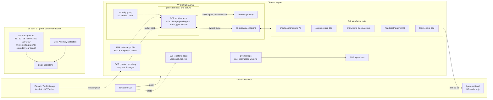
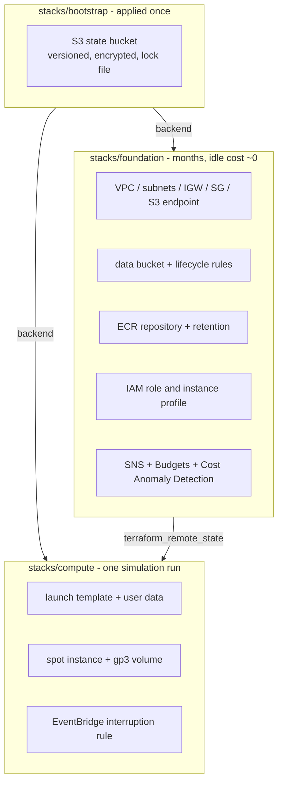

# Architecture

Cloud execution environment for the Einstein Toolkit gallery's [binary
neutron star example](https://einsteintoolkit.org/gallery/bns/index.html),
on the design that carried the [GW230529 BH-NS
simulation](https://github.com/s-sasaki-earthsea-wizard/gw230529-einstein-toolkit-aws-tf)
to completion in August 2026.

**Provenance.** This document was written for GW230529 and imported. The
topology, the stack split, the checkpoint slots, the sidecar and the cost
containment carry over unchanged; the measurements that justify their sizing
— memory, checkpoint size, sec/iter, cold start — are GW230529's and are kept
as the evidence behind the design, labelled as such. Nothing has been measured
for the BNS on AWS yet. Its numbers, and the band they currently sit in, are
in the README's *The simulation* and *Cost model* sections; the first
throughput probe replaces them.

Constraints that shaped every decision:

- **200 USD total budget** (300 for GW230529). Anything that bills by the hour
  while idle is out.
- **Single spot node.** No multi-node, no EFA. The gallery's own run of this
  parfile is 32 MPI ranks; a 96-core c7a.24xlarge at 24 ranks × 4 threads is
  the closest single-node shape, and the grid — about 8.3 M points on a
  quarter domain — is small enough that going wider mostly buys ghost zones.
- **S3 is the system of record.** EBS is scratch. A spot interruption must
  never lose more than one sync interval of work.
- **No inbound ports.** Operations go through SSM Session Manager. The
  gallery parfile's HTTPD is dropped for the same reason.

## Resource topology



### Why a public subnet

The node needs outbound access for the SSM agent and inbound access for
nothing. Both private-subnet designs cost real money against a 300 USD cap:

| Option | Idle cost | Verdict |
| --- | --- | --- |
| Public subnet + internet gateway + S3 gateway endpoint | **0 USD/month** | adopted |
| Private subnet + NAT gateway | ~33 USD/month plus data processing | rejected |
| Private subnet + 5 interface endpoints | ~36 USD/month | rejected |

A public subnet with an empty ingress rule set has the same effective exposure
as a private one: no port is reachable. The S3 gateway endpoint is free and
keeps sync traffic off the internet gateway entirely, which also removes any
path to an accidental egress charge.

## Region and instance selection

> **GW230529 measurement record.** This section and the two that follow —
> *Choosing the instance type*, *What the run will cost* — are the sibling
> project's, kept verbatim as the evidence behind the design. For the BNS
> the region choice stands (nothing about it depended on the instance size),
> the instance type is c7a.24xlarge pending the first probe, and the cost
> band is in the README. The scout has to be re-run for a 96 vCPU request
> before any of the zone ordering below is relied on.


The region is effectively permanent — ECR images and S3 objects are
region-bound, so moving means re-pushing 4.06 GB and re-uploading every result.
`make region-scout` produces the three numbers the decision rests on.

Measured 2026-08-19, target capacity 192 vCPU, single availability zone,
scored across c7a/m7a/c7i .48xlarge. The candidate list has changed since —
see "Choosing the instance type" below — but the regional conclusion has not,
because every candidate is a 192 vCPU AMD Genoa part drawn from the same pool:

| Region | Zones scoring 9 | Cheapest c7a.48xlarge | Spot vCPU quota |
| --- | --- | --- | --- |
| us-west-2 | 3 of 4 | 2.970 USD/h (us-west-2d) | 256 |
| us-east-1 | 4 of 6 | 2.996 USD/h (us-east-1a) | 256 |
| us-east-2 | 2 of 3, one at 6 | 2.572 USD/h (us-east-2a) | **5** |

**us-east-2 is out**: cheapest by ~15%, but the spot vCPU quota is 5, and a
quota increase takes hours to days to approve. Over a 76 hour run the saving
is about 30 USD — real money against a 300 USD cap, but not worth putting the
schedule behind a support ticket, and us-east-2 also scores 9 in only two of
its three zones.

**us-west-2 over us-east-1.** Capacity is not the differentiator — both score
9 with the quota already raised. The averages across their viable zones are
3.11 USD/h for us-west-2 against 3.32 for us-east-1, roughly 6 USD over a 30
hour run: also not the differentiator. What decides it is that us-west-2's
fallback zones stay near its cheapest (3.05 and 3.32 against 2.97), whereas
us-east-1's jump to 3.49 and 3.52. Being pushed off the preferred zone costs
less. us-east-1 also concentrates a disproportionate share of AWS-wide
capacity events; one fewer scoring zone is a smaller risk than that.

Preferred zone **us-west-2d** (`usw2-az4`), then `us-west-2a`, then
`us-west-2c`. Zone names are shuffled per account — the IDs are what stay
put, and `make region-scout` prints the mapping.

Those three names go into the foundation stack's `availability_zones`, and
that list is what the compute stack can choose from: it looks its subnet up by
zone name, so a zone with no subnet is a plan-time error rather than a
fallback. The alternative — taking the first N zones the region reports — sorts
by name, which in us-west-2 yields a, b and c: it omits the cheapest scored
zone and includes `us-west-2b` (`usw2-az1`), which scored nothing at all.
Subnets are free, so the fallback costs nothing but capacity; it is a default,
not a placement decision.

## Choosing the instance type

The reference run's own numbers, read out of its published Carpet log and
SLURM epilogue rather than from a summary (measured 2026-08-20 in the
simulation repository):

| Quantity | Reference run |
| --- | --- |
| Parallelism | 480 ranks, 12 nodes × 40 cores |
| Wall clock | 46.4 h to t = 3041 M; about 30.5 h to t = 2000 M |
| Target evolution | ~14,600 core-hours to t = 2000 M |
| Memory | 438.5 GB, 12 node total, as reported by SLURM |
| Speed | 3.30 sec/iter at dt = 0.06 M (480 ranks; 8.25 at 192 for equal per-core speed, against 4.16 measured) |
| Merger | t ≈ 713 M (ψ4 amplitude peaks at 1213 M, less the r = 500 M light travel) |

Two of these replace figures this document previously carried: the run is 480
ranks and not 256, and the memory is 438.5 GB and not 140 GB. The origin of
the 140 GB number could not be established, and it is no longer used anywhere.

### Memory decides it, not price

438.5 GB is a 12-node total at 480 ranks. A 192 rank run duplicates fewer
ghost zones and so needs less, but the reduction is weak: each rank's chunk
grows 2.5× in volume and only 1.36× in linear size, and ghost overhead follows
the linear size. Read the SLURM figure the most generous way available — as
decimal GB, hence 408 GiB — and it still sits above c7a.48xlarge's 384 GiB
before any reduction is applied.

The production instance type is therefore **not settled**. Phase 5 measuring
the np=192 working set is a go/no-go gate, not a formality: if it does not fit
one node, multi-node MPI stops being an optional later exercise and becomes a
requirement.

| Type | Physical cores | Memory | Channels | Spot USD/h | USD per physical core-hour |
| --- | --- | --- | --- | --- | --- |
| c7a.48xlarge | 192 Genoa @ 3.7 GHz | 384 GiB | 12 × DDR5 | 2.978 | **0.0155** |
| m7a.48xlarge | 192 Genoa @ 3.7 GHz | 768 GiB | 12 × DDR5 | 3.747 | 0.0195 |
| r7a.48xlarge | 192 Genoa @ 3.7 GHz | 1536 GiB | 12 × DDR5 | 4.220 | 0.0220 |
| c7i.48xlarge | 96 SPR @ 3.2 GHz + HT | 384 GiB | 8 × DDR5 | 3.072 | 0.0320 |
| c7a.24xlarge | 96 Genoa @ 3.7 GHz | 192 GiB | 12 × DDR5 | 1.950 | 0.0203 |

us-west-2d spot prices, measured 2026-08-20.

**c7a.48xlarge is the production type**, decided by measurement on
2026-08-20 rather than by the projection this section originally carried. A
full resolution run at np=192 and 8 refinement levels reported 125.273 GByte
from Carpet and 136 GiB across the whole node — 35% of c7a's 384 GiB.

The earlier reasoning read the reference run's 438.5 GB as a floor for what
192 ranks would need. It is not: that is a scheduler's high water mark over
480 ranks spread across 12 nodes, and a decomposition that fine duplicates
far more ghost zones. Carpet reports the effect directly — grid function
points run to +95% over owned at np=192 against +68% at np=32.

m7a.48xlarge (768 GiB) stays the fallback if a merger-time regrid grows the
working set beyond the 2.8x headroom, with r7a.48xlarge behind it.

**c7i.48xlarge is out.** Its hourly price sits within 3% of c7a's, which is
precisely what makes it a trap: half of its 192 vCPUs are hyperthreads, so the
real number is 0.0320 USD per physical core-hour against c7a's 0.0155. Add
8 memory channels against 12 and 3.2 GHz against 3.7, and a bandwidth-bound
spacetime evolution gets about half a machine for the same money. It is no
longer scored by the scout — the price check settles it and no further
measurement will change the ratio.

**Going smaller does not help.** c7a.24xlarge holds 192 GiB, which no full
resolution run fits into, and it costs 31% more per physical core than the
48xlarge. Trading cores for wall clock on a smaller machine costs more and
spends longer exposed to interruption.

### What the run will cost

Measured, not projected, since 2026-08-21. A 90 minute probe at full
resolution on the production instance type reached t = 62.94 M in 1049
iterations:

| | Measured |
| --- | --- |
| Evolution loop alone, median sample | **3.75 sec/iter** |
| Effective rate, window mean with every overhead in it | **4.16 sec/iter** |
| `Carpet::physical_time_per_hour`, median | 54.06 M/h (= 4.00 sec/iter) |
| Agreement between the two independent readings | 3.9% |

At 4.16 sec/iter, the production end point of t = 1750 M (decided
2026-08-27) is 29,167 iterations:

| | **t = 1750 M (production)** | t = 2000 M (gallery) | 1500 M | (old) pessimistic 76 h |
| --- | --- | --- | --- | --- |
| c7a.48xlarge at 2.978 USD/h | **~100 USD, 33.7 h** | 115 USD, 38.5 h | 86 USD, 28.9 h | 226 USD |

The extrapolation this replaces bracketed the run at 38–76 hours: 14,600
core-hours on 192 cores is 76 hours at the reference cluster's per-core
performance, and Genoa at 3.7 GHz on 12 DDR5 channels was guessed at 1.5–2×
that. It measures 2.07×, just past the optimistic end of the band.

**The end point is a physics decision, not a cost one.** 1750 M keeps the
full ringdown at the r = 500 extraction radius (the merger signal arrives
there at t ≈ 1213 M) plus the early disc evolution — the dx=28 dry run and
the reference both show the remnant disc mass settled by merger + ~180 M —
and drops ~4.8 h of essentially flat tail that 2000 M would buy. 1500 M was
rejected as ending right on the ringdown's heels. The rewrite happens in
`make upload-inputs` (`CCTK_FINAL_TIME` overrides it).

**What the rate does and does not cover.** The window mean carries every
overhead the probe actually paid: one hourly checkpoint (85.7 GB, 76 s of
stopped ranks), one 2D output (31 s per 1024 iterations), and the periodic
analysis — AHFinderDirect every 16 iterations, VolumeIntegrals every 128,
Multipole and the 1D/0D output every 256. It does not cover the merger. The
probe sampled t = 0–63 M, 3% of the run and pure inspiral. Grid point counts
will not grow — `CarpetRegrid2` radii are fixed in M and `num_levels` is
pinned at 8 — but con2prim iteration counts can. The dx=28 dry run later
crossed its merger with no visible slowdown (2026-08-26), which demotes this
from expected cost to residual risk — but it is low resolution evidence, so
**treat 33.7 hours as a central estimate, not a ceiling.**

There is no cheap way to measure the merger: reaching it *is* the run. Watch
it instead, with `make throughput` against the live log.

Everything downstream of the run length in this document — checkpoint counts,
S3 residency, gp3 throughput cost — is still sized against 76 hours. The
measurement halved the expected wall clock rather than the ceiling, and a run
resumed a few times after interruptions spends longer than 33.7 hours
wall clock even at this rate. The headroom stays.

### Starting a run costs 18 minutes, not 6

The line stamping added on 2026-08-21 put a wall clock on the phases either
side of the evolution for the first time:

| Phase | Wall clock |
| --- | --- |
| Container start to Carpet grid statistics | ~1 min |
| FUKA/Kadath import, 8 refinement levels | 344 s (5.7 min) |
| Iteration 0 analysis, first AHFinderDirect search, 1D/2D/0D output | ~7.6 min |
| Initial data checkpoint, 85.7 GB | 86 s |
| **Total, container start to first evolution step** | **~18 min** |

The 7.6 minutes between the end of the import and the first horizon search had
never been visible: without timestamps the log shows one INFO line following
another. It is the reason `IO::checkpoint_ID = "yes"` matters more than the
import time alone suggested — an interruption without it pays 18 minutes, not
the 6 the import accounts for.

The 86 s for 85.7 GB is exactly the 1000 MB/s that `root_volume_throughput`
provisions, which confirms the design assumption of 78 s for 78 GB: the write
is bandwidth-bound and scaled with the file.

## Stack lifetimes



Splitting by lifetime rather than by environment buys three things:

1. `terraform destroy` on `compute` cannot reach the simulation data or the
   container image — they are not in that state file.
2. `foundation` can sit between phases without billing.
3. Re-launching after a spot interruption is a single `terraform apply`.

## Run lifecycle

```mermaid
sequenceDiagram
  autonumber
  participant OP as Operator
  participant TF as Terraform
  participant EC2 as Spot node
  participant S3 as S3 data bucket

  OP->>TF: make run
  TF->>EC2: launch from template
  EC2->>EC2: install docker, pull image from ECR
  EC2->>S3: sync checkpoints down (empty on a fresh run)
  EC2->>EC2: start simulation, sync timer, heartbeat timer, spot watcher

  loop every sync interval
    EC2->>S3: push checkpoints and output
  end

  alt spot interruption
    EC2->>EC2: metadata service returns spot/instance-action
    EC2->>S3: flush what is already on disk
    Note over EC2: about 2 minutes; no new checkpoint is requested
    EC2--xEC2: reclaimed by AWS
    OP->>TF: make run
    TF->>EC2: relaunch
    EC2->>S3: sync checkpoints down, resume via recover=autoprobe
  else run completes
    EC2->>S3: final sync
    EC2--xEC2: shutdown, terminating the instance
  end
```

The interruption path deliberately does **not** ask Cactus for a fresh
checkpoint. GW230529's generations were 85.7 GB — minutes to write and
minutes more to upload, against a two minute warning — and attempting one
would have risked the flush of the checkpoint that already existed. A BNS
generation is expected around 35–50 GB: under a minute to write at the
provisioned 1000 MB/s, but still minutes to upload, so the recovery point
stays the last checkpoint that finished uploading. Whether the write alone
now fits inside the warning — the cloud parfile keeps TerminationTrigger's
termination-file hook, so the watcher could request one — is worth
measuring; see the issue tracker.

## Checkpoint synchronisation

> Sizes in this section are GW230529's (78 GB designed, 85.7 GB measured per
> generation). A BNS generation is expected at roughly half that; the
> mechanism is unchanged.


Two properties matter more than the sync interval, and both come from the
78 GB figure.

**S3 holds two generations, not all of them.** A push-only mirror would
accumulate every checkpoint Cactus writes — 76 generations over a 76 hour run
at hourly checkpoints, 5.9 TB, roughly 31 USD until the seven day lifecycle
rule expires it. That is 10% of the project budget spent on copies nothing
will ever read. The sidecar instead alternates between
`checkpoints/<run_name>/slot-a/` and `checkpoints/<run_name>/slot-b/`.

The category comes first in every key the node writes — `checkpoints/`,
`output/`, `heartbeat/`, `logs/`, each followed by the run name. S3 lifecycle
filters match a prefix from the start of the key and nothing else, so this
ordering is what connects the data to the expiry rules above. The original
layout put the run name first, and every rule silently matched nothing until
349 GB of dead checkpoints made it visible (issue #17, 2026-08-26).

That bounds the growth but not the size, and the two are easy to conflate. A
push mirrors the whole checkpoint directory into a slot, so S3 residency is
two slots times the generations sitting on the volume — 312 GB at the default
`checkpoint_generations_kept = 2`, not the 156 GB that one generation per slot
would give. What holds it there is the sidecar pruning the volume after every
successful push, which Cactus does not do for itself: `IO::checkpoint_keep`
prunes within a run and not across restarts, and Phase 2 ended two runs with
three generations and 77 GB still on disk. Unpruned at production size, six
generations fill the 500 GB volume and put 936 GB in the bucket, and it is the
volume filling that ends the run.

**A `CURRENT` marker, not a timestamp, decides what gets restored.** Uploading
78 GB takes minutes, so an instance reclaimed mid-upload leaves a torn set in
S3. Restore combined with `recover = autoprobe` would select exactly that set,
because it is the newest. The marker is written only after the upload returns
success, so it always names a complete generation, and restore reads the
marker.

The sidecar also refuses to upload while Cactus is still writing, and skips
entirely when the checkpoint set has not changed since the last successful
push — which is what makes a short interval affordable.

### Choosing the intervals

```
work lost on interruption ~ checkpoint interval / 2 + sync interval / 2
```

The sync interval is the cheap term: a tick with nothing new is a LIST and
nothing else. The checkpoint interval is the expensive one, because writing
78 GB at 1000 MB/s stops every rank for about 78 seconds.

| Checkpoint interval | Write overhead | Lost per 76 h run | Mean loss per interruption |
| --- | --- | --- | --- |
| 15 min | 8.7% | 6.6 h | ~10 min |
| 30 min | 4.3% | 3.3 h | ~17 min |
| 60 min | 2.2% | 1.7 h | ~32 min |

Going from half-hourly to hourly saves about 1.6 hours of guaranteed overhead
over a 76 hour run and costs roughly 15 extra minutes per interruption. With a
spot pool scoring 9, fewer than one interruption per run is the reasonable
expectation, so hourly wins — and the longer the run turns out to be, the
wider that margin gets.

Defaults: **checkpoint hourly** (`IO::checkpoint_every_walltime_hours = 1.0`
in the parfile) with a **5 minute sync**. Revisit if Phase 4 measures
interruptions more often than once per run.

### What the transfer actually costs

Data transfer between EC2 and S3 in the same region is free, and the gateway
endpoint keeps it off the internet gateway. The bills that remain are small
and worth knowing:

| Item | Cost |
| --- | --- |
| PUT requests, one 78 GB checkpoint (192 rank files, 8 MB parts) | ~0.05 USD |
| PUT requests, 76 hourly checkpoints | ~3.8 USD |
| Storage, two slots at 156 GB each for a week | ~1.7 USD |

## What the node needs that the image does not carry

The parfile and the LORENE initial data are Einstein Toolkit gallery
artefacts and are not redistributable. Two files, 12 MB, therefore live under
`inputs/` in the data bucket and are fetched at boot. Baking them into the
image would also put upstream copyrighted data inside ECR, where a mis-set
repository visibility becomes a licensing problem rather than an
inconvenience.

`make fetch-inputs` downloads them from the gallery against pinned SHA-256
sums, into a gitignored `upstream/`, and decompresses the LORENE data set
there — LORENE reads the `.resu` directly, and doing it locally keeps `xz`
out of the node's boot path. The gallery's thornlist is fetched alongside,
because it is the record of the one thorn the release manifest lacks
(NSTracker) and where it comes from.

`make upload-inputs` derives the cloud parfile rather than uploading the
gallery one unchanged. The gallery file targets a batch queue under
simfactory; seven things change:

```
IO::checkpoint_every_walltime_hours   absent   -> 1.0             rewritten
IO::checkpoint_keep                   absent   -> 2               rewritten (the default is 1)
IO::checkpoint_dir                    $parfile -> "../CHECKPOINTS" rewritten
IO::recover_dir                       $parfile -> "../CHECKPOINTS" rewritten
TerminationTrigger::max_walltime      @WALLTIME_HOURS@ -> 8760    rewritten (a simfactory placeholder)
HTTPD, Socket                         active   -> dropped         segfaults in the container without a socket
IO::checkpoint_ID                     = "yes"                     asserted
IO::recover                           = "autoprobe"               asserted
```

Nothing is uploaded unless every check holds — a `sed` that silently matches
nothing is the failure this is guarding against, the same hazard the node
guards against when it aborts on a failed initial-data path rewrite. When the
BNS image is on the machine, Cactus itself is then asked to check the file
(`--exit-after-param-check`), which is how the HTTPD crash was found: the
thorn fails to bind its socket inside the container and Carpet aborts.

`checkpoint_ID` is the one that matters most. Without an initial-data
checkpoint, every spot interruption re-imports the LORENE data and redoes the
iteration 0 setup before evolution resumes. How long that takes on this
instance is not known — the gallery log is unstamped — and is one of the
numbers the first probe is for; GW230529's equivalent was 18 minutes, of which
the import itself was only a third.

The parfile names the LORENE data set by absolute path — whatever machine the
gallery example was last run from. The node rewrites the directory to its own
mount point at boot, keeps only the basename, checks the file is actually
there, and aborts if any of that fails rather than letting the run die later
on a missing file.

### Where checkpoints land

The cloud parfile sets `IO::checkpoint_dir = "../CHECKPOINTS"` (the gallery's
`$parfile` is rewritten by `make upload-inputs`), relative to the run's
working directory. With a run directory of
`/home/etuser/simulations/<run_name>/run`, checkpoints resolve to
`/home/etuser/simulations/<run_name>/CHECKPOINTS`, so the bind mount is placed
there and the parfile is left alone:

```
host                          container
$WORK/simulations        ->   /home/etuser/simulations
$WORK/checkpoints        ->   /home/etuser/simulations/<run_name>/CHECKPOINTS
$WORK/inputs             ->   /home/etuser/inputs  (read only)
```

The checkpoint mount nests inside the simulations mount, which keeps the two
separate on the host — that separation is what lets the sidecar rotate
checkpoints through slots while pushing output additively. The output sync
also excludes `*/CHECKPOINTS/*` so that a missing inner mount costs a warning
rather than a second upload of every checkpoint.

Because `checkpoint_dir` is relative, two runs sharing a parent directory
share a checkpoint directory, and `recover = "autoprobe"` would restart one
resolution from another's checkpoint. `run_name` is the parent directory, so
it should name the resolution.

## The ops rehearsal runs no physics

`run_mode = "ops-rehearsal"` exists to prove the operations loop on a cheap
instance. For GW230529 that was forced — no resolution of that grid both fit
16 GiB and ran, as the table below records — and it holds for the BNS as
well: the gallery run's ~89 GiB at 32 ranks does not fit a c7a.2xlarge
either, and a coarser BNS grid would hit the same box-size floor. The
rehearsal stays synthetic. The GW230529 table, for the record:

| Grid | Memory | Fits 16 GiB? |
| --- | --- | --- |
| dx=28.0 | 37.1 GB measured | no |
| dx=33.6 | 21–26 GB estimated | no |
| dx=67.2 | 11.6 GB measured | yes, but NaNs on the first evolution step |

dx=67.2 fails for a structural reason rather than a resolution one. The
`CarpetRegrid2` radii are fixed in M, so a coarser `dx` leaves the refinement
boxes the same physical size with fewer cells — level 1 holds 17 against the
production grid's 62, less than the ghost zones and prolongation buffers
consume, and the run aborts with `GRHayL: u^0 evaluated to NaN`.

The alternative would be c7a.8xlarge at 64 GiB, spending most of the Phase 4
budget on a run whose output is discarded. Instead `run_mode =
"ops-rehearsal"` writes a payload shaped like a checkpoint set — one file per
rank, rewritten periodically — which is what the sidecar actually has to cope
with. Slot rotation, the `CURRENT` marker, the interruption flush and the
restore path all get exercised, on a c7a.2xlarge, and interruptions can be
triggered as often as they are useful.

The physics waits for the probe on the real machine.

## Cost containment

Two independent mechanisms, and only one of them is real time.

**Real time.** The spot request is capped at the on-demand price, so the
hourly rate has a hard ceiling. The node terminates itself when the run exits
(`instance_initiated_shutdown_behavior = "terminate"` plus a `shutdown` at the
end of the bootstrap script), so a finished or failed run stops billing
without operator action.

**After the fact.** Budgets fire at six absolute USD thresholds and Cost
Anomaly Detection watches for a step change in daily spend. Both are useful
and neither can prevent anything: AWS billing data lags 8–24 hours.

## Known operational hazards

| Hazard | Handling |
| --- | --- |
| The BNS working set on AWS is unmeasured | The gallery's own run reports 43.8 GByte from Carpet and ~89 GiB resident at 32 ranks; c7a.24xlarge holds 192 GiB. The first probe measures it on the rank count actually used. (GW230529's equivalent question was settled at 136 GiB against 384.) |
| `IO::checkpoint_keep` does not prune across runs | GW230529 saw three generations after two runs. The S3 slot rotation bounds S3 only — the sidecar prunes EBS itself, keeping the generation `CURRENT` names plus one. Inherited and exercised in production. |
| Spot vCPU service quota defaults far below 96 | Raise it before the probe; approval takes hours to days. `make region-scout` reports the current value; an account that ran GW230529 already holds 256 in us-west-2. |
| `InsufficientInstanceCapacity` on a 96 vCPU request | Vary `availability_zone` first — only zones listed in foundation's `availability_zones` are reachable — then `instance_type` across c7a.16xlarge / 24xlarge / 48xlarge. Not c7i: it is half the machine at twice the price per real core. A search over (zone, type) pairs instead of a pinned pool is an open issue inherited from GW230529. |
| Deep Archive bills a 180 day minimum | `artifacts/` transitions after a delay, so a bad run can be deleted before it is archived. |
| The gallery parfile is unfit for spot as shipped | `make upload-inputs` derives the cloud variant — seven changes, listed above — and refuses to upload one that fails any check. Cactus's own parameter check runs when the BNS image is present. |
| SNS subscriptions start unconfirmed, and can be deleted later by one click on any unsubscribe link | Follow "Confirm subscription" in both mails after the first apply, and note that the Terraform resource survives an unsubscribe, so nothing reports the loss. `make check-alerts` tests delivery; `make run` refuses to start billing when either topic is disarmed. |
| A budget filtered on an unactivated cost allocation tag never fires | `cost_allocation_tag` defaults to null, giving an account-wide budget. |
| Region is effectively permanent | ECR and S3 are region-bound; re-pushing means moving ~4 GB. Decide with `make region-scout` before the first apply. |
| Two projects share one account | The GW230529 and BNS budgets both measure account-wide spend until the `Project` cost allocation tag is activated, so each counts the other. `preexisting_spend_usd` is the stopgap; the tag is the fix. |
